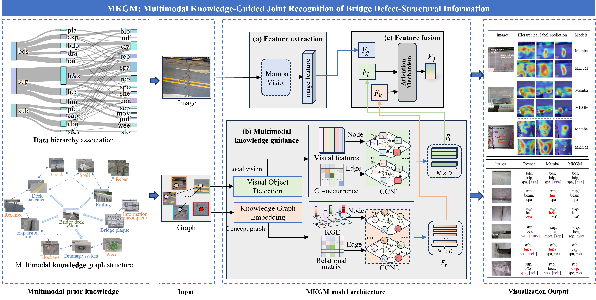

# BDSJR_MKGM
A Multimodal Knowledge Guided Model (MKGM) for joint recognition of bridge defect and structural information.

# 🏗️ BDSJR_MKGM

**Multimodal Knowledge Guided Model (MKGM)** for Joint Recognition of Bridge Defects and Structural Information.

## 🔍 Overview

Structural defect recognition is a crucial task in bridge inspection. However, existing methods typically focus solely on detecting surface defects while neglecting the structural context — such as regions and components — present in the background. This limits fine-grained defect understanding and causes misalignment in defect attribution.

To address this challenge, **MKGM** introduces a multimodal knowledge-guided framework that jointly recognizes bridge defects along with their associated structural regions and components. It leverages image-text knowledge, concept graphs, and label co-occurrence patterns to guide feature propagation and semantic reasoning across hierarchical labels. The model incorporates:

- 📷 **MambaVision** for global and local visual feature extraction  
- 🌐 **Multimodal knowledge graphs** for label representation  
- 🔁 **Dual-channel GCNs** for structured semantic propagation  
- 🧠 **Attention-based fusion** for final multi-label classification  

---

## 🧠 Graphical Abstract

  

